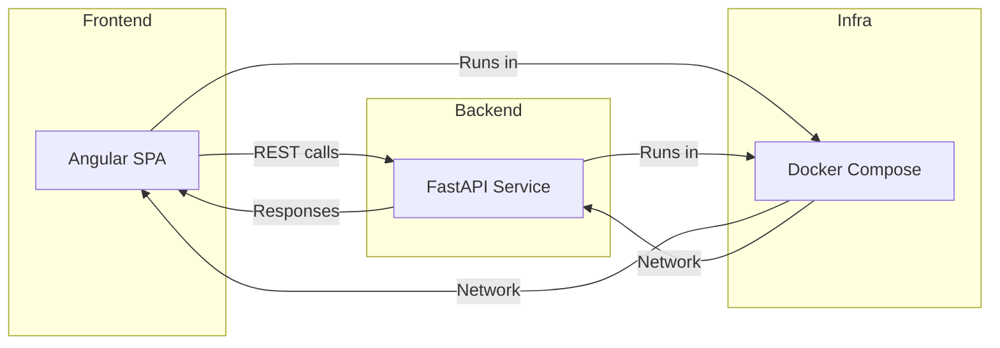

# Architect Mission Report

**Agent**: architect  
**Generated**: 2026-08-09T16:20:38.787Z

---

## Architecture Style

Two‑service architecture (frontend Angular SPA + backend FastAPI) deployed via Docker Compose

## Components

- **Frontend Web UI** (Web Application): Angular single‑page application that renders the player's own board and the attack view, handles ship placement and shot actions, and communicates with the backend via REST.
- **Backend API Service** (API Service): FastAPI application that holds the in‑memory game state, validates ship placement, enforces turn order, computes hit/miss/sunk results, and returns a sanitized view for each player.
- **Docker Compose Orchestrator** (Infrastructure): Docker Compose file defines two containers (frontend and backend), a shared network, and restart policies, providing a single‑command development and demo environment.

## Tech Stack

- **Frontend Framework**: Angular 16 (TypeScript) — Angular provides a full‑featured CLI, built‑in routing, and strong typing out of the box, which speeds up a small SPA without needing to select additional libraries. React and Vue are viable but would require extra decisions (state management, routing) for a project of this size.
- **Backend Framework**: FastAPI (Python 3.11) — FastAPI offers automatic OpenAPI docs, async support, and data validation via Pydantic, reducing boilerplate for request/response models. Flask would need manual validation and doc generation; Express adds JavaScript runtime overhead and lacks built‑in data validation.
- **Container Runtime**: Docker Engine — Docker is universally installed, integrates seamlessly with Docker Compose, and matches the assignment’s expectation of a single `docker compose up --build` command. Podman/Buildah are compatible but add friction for developers unfamiliar with their CLI nuances.
- **Orchestration**: Docker Compose v2 — Compose is lightweight, requires no cluster, and is perfect for a two‑service development environment. Kubernetes would be overkill for a 45‑minute assignment; Swarm adds complexity without tangible benefit.
- **Programming Language (Backend)**: Python 3.11 — Python’s readability and the Pydantic model system align with FastAPI’s design, enabling rapid development. Node.js would duplicate language stack with the Angular frontend but lacks native data‑validation models; Go would require more boilerplate for a simple in‑memory service.
- **Data Store**: In‑memory Python dict (per‑process) — The assignment explicitly states no persistent storage is required. An in‑memory dict satisfies the need for fast look‑ups and keeps the stack minimal. SQLite would add file I/O for no benefit; Redis introduces an external service and networking overhead.
- **CI/CD**: GitHub Actions — GitHub Actions is free for public repositories, requires no additional server, and can run Docker builds and lint checks with minimal configuration. GitLab CI is comparable but would need a GitLab instance; Jenkins adds operational overhead.
- **Testing Framework (optional future)**: pytest (Python) & Karma/Jest (Angular) — pytest provides concise syntax and powerful fixtures; Karma/Jest are the default testing tools for Angular projects. Alternatives exist but are less commonly used in modern Angular or Python ecosystems.

## Epics

- **EPIC-1** Game Session Management: Create, store, and retrieve a game session with isolated in‑memory state for each pair of players. Expose endpoints to initialise a new game and query its current status.
- **EPIC-2** Ship Placement: Allow Player 1 to place three ships of sizes 2, 3, 4 on a 6×6 board. Backend validates no overlap and bounds, then records positions.
- **EPIC-3** Turn‑Based Shooting: Implement the turn logic: Player 1 fires a coordinate, backend returns hit/miss/sunk and updates turn. Prevent out‑of‑turn actions and report errors.
- **EPIC-4** Board Visualization: Render two grids in the UI – the player’s own board (showing own ships and opponent hits) and the attack view (showing hits/misses on the opponent). Update in real time after each shot.
- **EPIC-5** Docker Compose Deployment: Containerise both frontend and backend, write a docker‑compose.yml that builds the images, defines a shared network, and exposes ports for local development.

## Architecture Diagram

