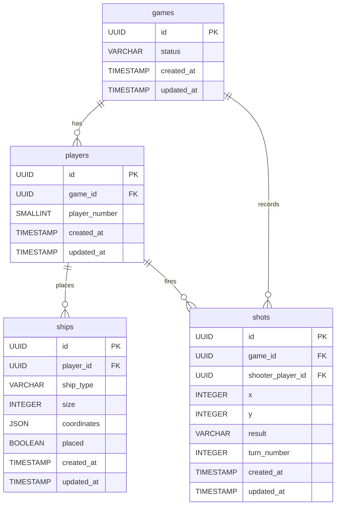

# DBA Mission Report

**Agent**: dba  
**Generated**: 2026-08-09T16:21:14.517Z

---

## Database Engine: In-memory Python dict (no external database)

The architecture explicitly specifies an in‑memory Python dictionary for game state storage to keep the MVP simple, avoid external dependencies, and satisfy the requirement of no persistent storage. Using this approach aligns with the FastAPI service design, enables fast read/write operations within a single process, and matches the NFR of simplicity.

## Entities (4)

- **games**: 4 columns
- **players**: 5 columns
- **ships**: 8 columns
- **shots**: 9 columns

## ERD

