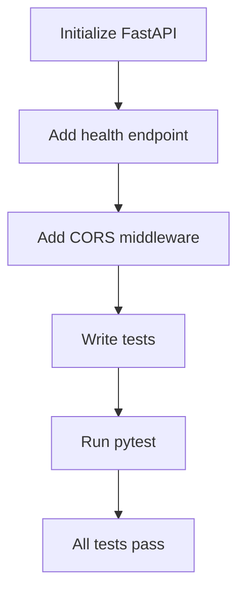

# Junior Python Developer Mission Report

**Agent**: junior-python  
**Generated**: 2026-08-09T16:23:06.569Z

---

## Branch: battleship5/chore/scaffold

## Files Changed

- **created** `main.py` — Initialize FastAPI app with health endpoint
- **modified** `main.py` — Add CORS middleware for Angular origin
- **created** `requirements.txt` — Add FastAPI and uvicorn dependencies
- **created** `tests/test_main.py` — Tests for health endpoint and CORS configuration

## Notes

Implemented FastAPI scaffold with health check, added CORS middleware for http://localhost:4200, provided requirements, and created pytest tests covering both functionalities.

## Diagram

